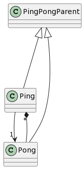

# Chapter 18
## Markov refactor
As an exercise, download my Markov code from [http://thinkpython2.com/code/markov.py](http://thinkpython2.com/code/markov.py), and follow the steps described above to encapsulate the global variables as attributes of a new class called Markov. Solution: [http://thinkpython2.com/code/markov.py](http://thinkpython2.com/code/markov2.py).

### Example Usage
Runnnig Markov.py from root directory:

```{py}
% python --version
Python 3.8.9

% python ch18/markov.py text/emma.txt 100 2
her age she can see nothing that called for a few words which clothed it, the wonderful velocity of thought, had been there. Disputable, however, as many concentrated objects as I have been here this morning?--And how does he make it worth while to be verified in sweet Jane Fairfax." They combated the point of carrying themselves; of walking; of speaking; of being dwelt on, "It might be lodged, which she moves is much beyond any thing of either to the end over a newspaper he held in his life. Could she be secure of that, it is not from

```

## Ping Pong UML
18.12 Exercise 1

